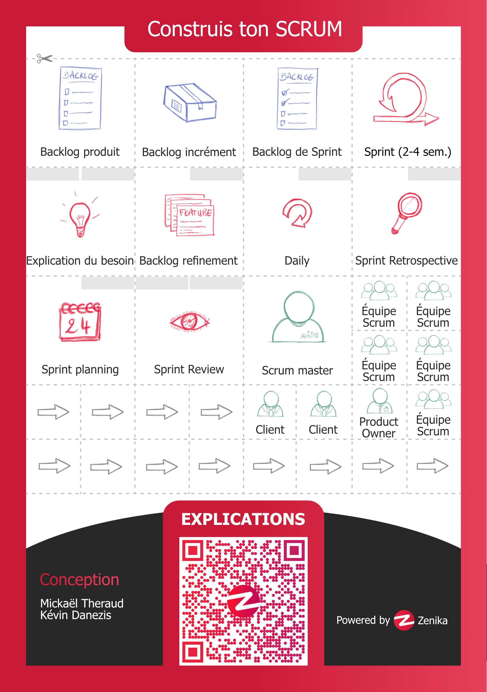

# Introduction

Construis ton SCRUM est un atelier permettant de découvrir ou redécouvrir le cadre de ce framework en manipulant ses éléments centraux.

Pour ce faire, il faudra découper les différents éléments disponible de la fiche ci-dessous afin de constituer le cycle SCRUM tel que tu le conçois aujourd'hui.

Pour ce faire, il y a 4 types d'éléments :
- Les artefacts, de couleur bleue ;
- Les événements, de couleur rouge ;
- Les acteurs, de couleur verte ;
- Les éléments de liaison, de couleur grise.

Pour chacun des événements, il faudra retrouver les acteurs qui y participent (égal au nombre de rectangles gris disponibles sur les  éléments).

Pour plus d'explications sur les éléments à découper, veuillez vous rendre [sur cette page](./pages/explications.md).

Si vous avez terminé la construction de votre SCRUM, vous pouvez vérifier [la solution](./pages/solution.md).