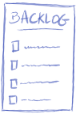

# Explications

Ci-dessous vous trouverez les explications des éléments découpables de la fiche.

## Les artefacts

### Backlog produit

Le backlog produit un l'ensemble des éléments réalisables et implémentables par l'équipe Scrum. Celui-ci est géré par le Product Owner en fonction des demandes qui lui sont adressées.

### Backlog incrément

L'incrément est l'ensemble des réalisations produites par l'équipe Scrum, en fin de Sprint.

### Backlog de Sprint

Le backlog de Sprint est l'ensemble des éléments arrêtés et décidés par l'équipe Scrum, pour le Sprint qui démarre. Il est issu du backlog produit.

## Les évènements

### Sprint (2-4 sem.)

Le Sprint est l'élément central du framework Scrum. C'est lui qui represent la boucle dans laquelle on produit l'ensemble du backlog de Sprint.

### Explication du besoin

Avant qu'un élément arrive dans le backlog Produit du Product Owner, un besoin est adressé et retranscrit en élément réalisable et compréhensible par l'équipe Scrum.

### Backlog refinement

Le refinement est un événement d'équipe qui vise à prendre connaissance des nouveaux éléments réalisable du backlog Produit. Le Product Owner présente les nouvelles fonctionnalités demandées et qui vont arrivées au reste de l'équipe Scrum. Cet événement peut arriver à plusieurs reprise pendant un Sprint, en fonction des besoins du Product Owner.

### Daily

Réunion journalière et point de rencontre de l'équipe Scrum durant la totalité du Sprint. Cela permet de rester en contact et de communiquer les informations que chaque membre de l'équipe juge utile à partager au autres. Les avancés, les obstacles, les contraintes, ou tout autre information importante pour aider l'auto-organisation de l'équipe.

### Sprint Retrospective

A la fin de chaque Sprint, l'équipe Scrum se réunit afin de faire la Rétrospective du Sprint passé, c'est le bon moment pour revoir l'organisation.Ce que l'équipe souhaite commencer, améliorer ou arrêter par exemple.

### Sprint planning

### Sprint Review

La culture du feedback est très importante en agilité, c'est pourquoi une Sprint Review est organisée en fin de Sprint. L'objectif est de montrer l'incrément produit à l'ensemble des parties prenantes du projet afin de récupérer des retours sur celui-ci. Savoir si la fonctionnalité développée répond au besoin initial, si c'est suffisant ou, au contraire, si il faut revoir des choses.

## Acteurs

### Equipe Scrum

L'équipe Scrum est formée de toute l'équipe de réalisation du produit, le Product Owner ainsi que le Scrum Master.

### Product Owner

Le Product Owner est le garant de la clarté et la priorisation du Product Backlog. Il récolte le besoin, rédige et adapte les réalisations à produire.

### Client

Le client, partie prenante ou commanditaire est la personne qui exprime son besoin. Qu'il soit fonctionnel ou technique.

### Scrum master

Le Scrum Master est le défenseur du cadre Scrum et de l'agilité en général. Il agit généralement en tant que coach, guide, formateur et facilitateur pour l'équipe afin de l'accompagner dans l'auto-organisation.

## Element de liaison

### Flèche

La flèche est a utiliser, à votre guise, pour joindre les éléments entre eux. Il y en a plus que nécessaire.